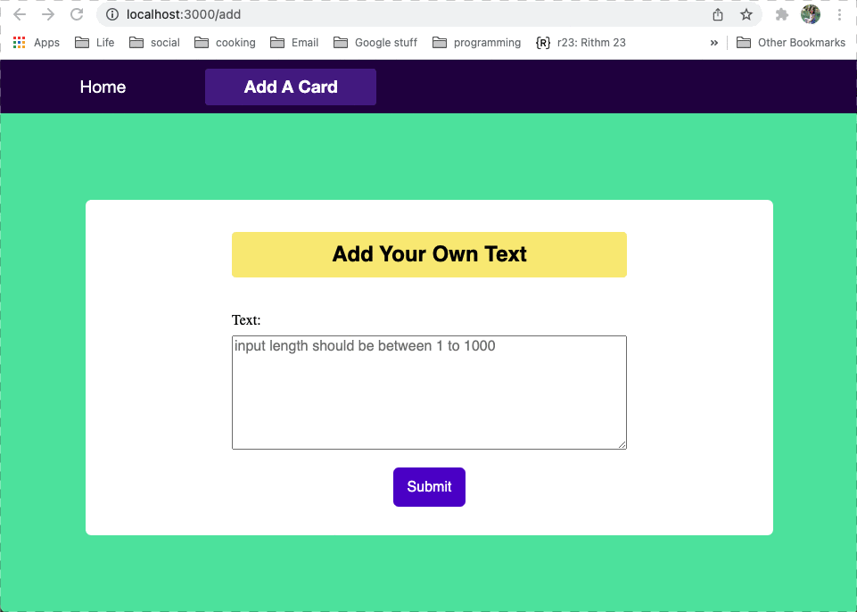

## Note

This project is an implementation of the [React Boilerplate](https://github.com/react-boilerplate/react-boilerplate). Please visit link to see more details on the template.

## App Description

<dl>
  <dt>Home Page</dt>
  <dd>Allow users to see all contents received from database! The record added by user most recently will be highlighted. </dd>

  <dt>Form Page</dt>
  <dd>Allow users to add a string to the database. Page displays success/error messages received from the server.</dd>
</dl>

## App Demo:

## Quick start

1.  clone the repo using `git clone https://github.com/andorjen/react-boilerplate.git <YOUR_PROJECT_NAME>`
2.  Move to the appropriate directory: `cd <YOUR_PROJECT_NAME>` 
3.  Run `npm run setup` in order to install dependencies and clean the git repo. 
4.  Run `npm run start` to explore the app at `http://localhost:3000/`

## Tests

1. run all tests: `npm test`
2. run tests for one component/container: `npm test -- <ComponentName>`
3. update snapshots: `npm test -- -u`
4. run tests in watch mnode: `npm run test:watch`

## License

This project is licensed under the MIT license, Copyright (c) 2019 Maximilian
Stoiber. For more information see `LICENSE.md`.
